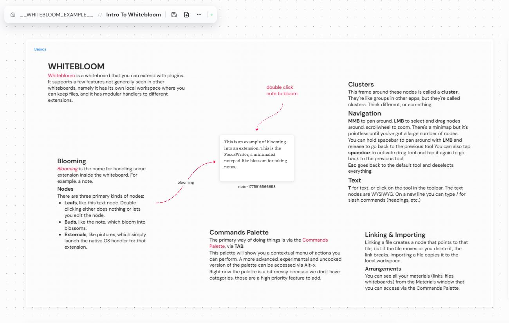

# WHITEBLOOM

A whiteboard. Local only, plaintext first, modular.



## Features

Local whiteboard with typical features such as writing text, loading images, groups, etc. Unlike cloud or proprietary whiteboards it gives you absolute control over your resources.

Whitebloom is desktop only, it does not support tablets or phones.

### Materials

Whitebloom uses Materials as the primary resource. A material can be either a file (including whiteboards) or a link such as URL. Your materials can be managed via Arrangements (TAB to launch the palette, then start typing `materials` or find it in the actions). URLs, links, and raw files appear here. There are two ways to arrange your materials: via bins and sets.

Bins are exclusive buckets where the material can live. A material can be in only one bin (or none, in which case it appears inside the Loose entry). Materials can only be deleted by first dragging them to the trash bin (which will check if the material is being in use in any whiteboard first).

Sets are hierarchical and inclusive. A material can be in any number of sets. They work similarly to labels in Gmail.

Each workspace keeps it own list of materials, shared by all boards in the workspace. Materials are **logical** (also called virtual) views of files, so arranging materials in any way will not change the files on disk. You're free to move materials around as much as you want, the actual files won't be touched (except through deleting them on the trash bin).

Material can be either imported or linked to the boards. You can select the default behavior in settings, or perform a particular action via right clicking on canvas or via the commands palette. Importing a material makes a local copy inside the workspace, keeping it fully self contained. Linking stores a link to the file. Linking is much more lightweight and if you update the original file you can see the changes, but if you move or rename or delete the file the link becomes broken, so you have to watch out for that.

### Using Material

All materials can be dropped on canvas. Whiteboards too. So you can link to whiteboards from a whiteboard.

For materials that don't have an easy "open with native app" capability we are writing specific modules. For example, you can link **Obsidian Vaults** by drag and dropping the vault folder into the canvas. The module will recognize it's a vault and link it with an Obsidian icon. Double clicking it will open it in Obsidian.

### Native Files

Whitebloom is a bit different from other whiteboards because you an drag native files from the filesystem. You can drag PDFs, PureRef boards, Excel spreadsheets, anything. On drop, Whitebloom checks if a handler has been registered for this format. If Whitebloom can't handle the file internally, it creates a native OS link so that you can double click on it and open it in whatever app your OS uses to open this file. This is useful if you have some files related to some topic on the whiteboard.

Remember to check if you're linking or importing the files, you can set the default behavior in the settings (click the ... button on the top bar).

### Whiteboard Features

These are your vanilla whiteboard features, there's not much to say about it. One particular feature is that it's not only tool based, but also command based, so you can do all things via a commands palette (`TAB` key). The palette also has a power user mode, accessed via `Alt-x` that exposes meta commands.

### Recording your session

You can record your session to a .webm (we may change that later) using the meta command (`Alt-x`) `screen.start-recording`. This saves a file to `recordings/` inside the workspace folder. You can stop recording via the `screen.stop-recording` meta command, or by `F8`. Recording tries to access your microphone so you may be prompted for permissions depending on platform. If it can't find a mic an icon will appear with a muted microphone. While recording, a red dot is visible at the top right of the screen.

This is not meant to be a replacement for specialized software like OBS. It's a small tool that lets you do one thing without worrying about configuration or anything like that. If you need power user features use OBS. This tool also doesn't handle system sound because that's a different can of worms and at this point, unless users absolutely require that feature, is outside the scope of the tool.

## Supporting the Project

If you'd like to support the project, consider donating to my Ko-Fi. All money will go toward tokens.

[](https://ko-fi.com/whitebloom)

## Precompiled Binaries

There's binaries for both Windows and Linux on the Releases tab.

### Apple
No Apple binaries unless somebody sponsors me $100 for the Apple Developer plan, and even then it's subject to Apple requirements (I don't know if I need an actual Mac, which I don't own). If you want precompiled binaries for Apple contact me. You can still build it by cloning the repo and following the instructions below (I think, I don't own a Mac to try).

## Project Setup

### Install

```bash
$ npm install
```

### Development

```bash
$ npm run dev
```

### Build

```bash
# For windows
$ npm run build:win

# For macOS
$ npm run build:mac

# For Linux
$ npm run build:linux
```

# License

Apache 2.0 + Commons Clause

This project is licensed under Apache License 2.0 with the Commons Clause. Commercial use, corporate deployment, government use, or any "selling" (as defined in the Commons Clause) requires a separate paid license. Contact whitevanillaskies@proton.me for details.
